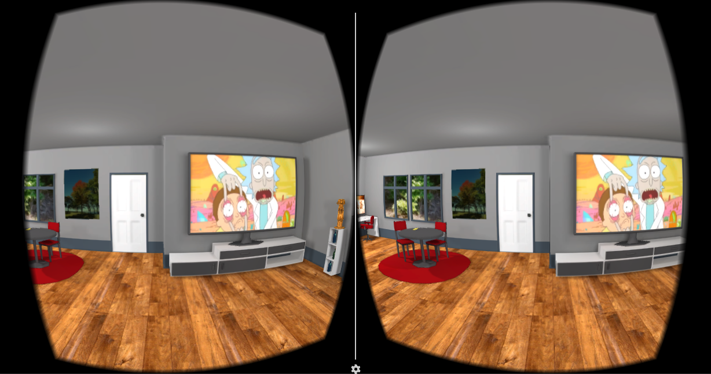

# Mobile VR Apartment

As part of the Udacity VR Nanodeveloper degree, one of the first projects in Unity was to create a VR Apartment. This was a project that connected some of the more basic concepts of creating and interacting with a VR environment built in the Unity game engine and deployed to a mobile APK using the GoogleVR SDK. 

  

Key concepts in this project include:

### Building environments

Games and VR experiences need worlds. Environments build in Unity consist of putting together assets, having skyboxes to enhance the intended mood, and giving the user things to explore an interact with. This project was one of the early projects to start building an environment, and an apartment setting was created.

  

### Locomotion

Mobile VR has only 3 degrees of freedom. The user can look left / right, up / down, and tilt their view of the environment. Modern VR systems such as the Oculus Rift or HTC Vive have 6 degrees of freedom which allows for translational motion in 3 dimensions along with rotational motion. For a mobile VR environment, some way of getting around is needed if movement within the game world is intended. One common approach to this is to use the click button of the VR headset to move to a specified waypoint. These waypoints are positioned around the environment and when the user looks at one and clicks the headset, they move to that position in the environment.

  

### Interactions and Animations

By using the Unity animation tool, a globe spin was animated and triggered by the click of the mobile VR headset. The Google VR viewer listens for a click which can be initiated on older mobile headsets as a magnetic "button" or the more recent headsets which essentially have a screen press as a button, and that click is used with `Animator.SetTrigger()` to play the animation once, spinning the globe. The user uses the waypoints to naviagate closer to the globe and can spin the globe using this process.

  

### VR Mode Build

This project uses the Google VR SDK to display 2 camera views of the scene. When the build is pushed to an Android device, it will split the phone into a left and right view, while properly distorting the views to counter the lens distortion. A "Google cardboard" viewer is used which is literally cardboard with two lenses. The mobile phone is held in the viewer and the screen is placed at a distance away from the lenses equal to the focal length of the lenses.

  

In this image, _f_ is the focal length distance of the lens. Light rays from a pixel are divergent, and leave the phone screen. They pass through the lens which when coming from a distance equal to the focal length, they become parallel rays. This places a virtual image of the particular pixel at optical infinity, which allows the retina lens in the eye to focus these rays onto the retina. Optical infinity means the magnified phone screen image isn't appearing to come from as close up as it actually is to the eye, but rather from very vary far away so the eye can comfortably focus the image without eye strain.

The image displayed on the phone screen looks like:

  

To view this project on an Android device, copy the build from the build folder onto the phone. Install the build by navigating to the directory you copied it to, and launch the APK file. After the build installs, launch it and it should launch in VR mode. Place the phone into a cardboard viewer (this also works on a Samsung Gear) and place the viewer against your face. To navigate around by waypoints, just look at one and click the button (depending on your viewer). The globe animation can be animated by looking at the globe and clicking on the button which will animate it.

  

  

Happy VR viewing!

